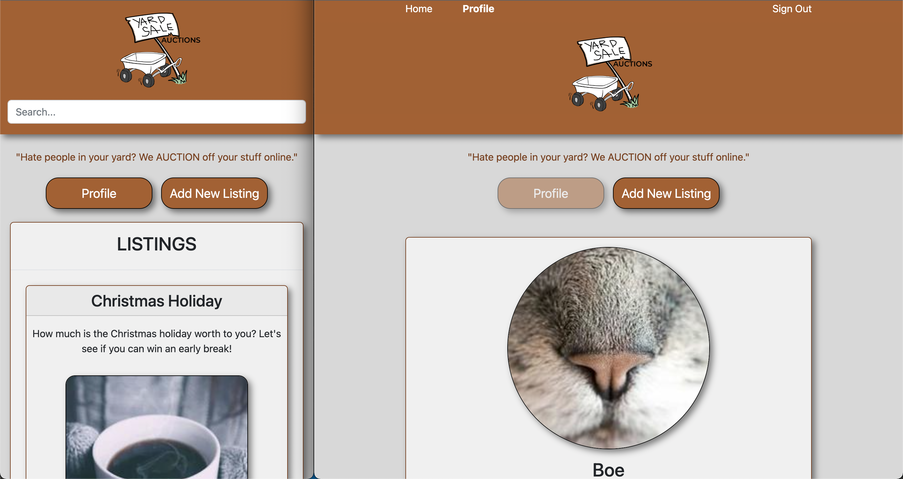
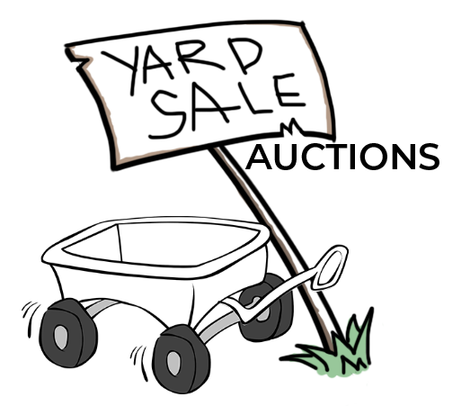

# Semester-Project-2-YSA



Above is a screenshot of the listing page and profile page from a online Yard Sale Auction Site made as part of the second semester project.

[](https://app.netlify.com/sites/yard-sale-auctions/deploys)

## Introduction

The online yard sale auctions page was created as part of the second semester projects. The brief given was to create an auction site for a company where users can add items to be bid on and bid on items other users have put up for auction.

"When a new user joins the website, they are given 1000 credits to use on the site. They can get credits by selling items and use credit by buying items. Non-registered users can search through the listings, but only registered users can make bids on listings."

I wanted my target audience to be the average user (families and teenagers) wanting to get rid of stuff they have laying around, hence the name "yard sale auctions".

Built using HTML, CSS frameworks and JS.

## CheckList for delivery

### Delivery links

- [x] A Gantt chart for project timing
      https://trello.com/invite/b/BNDQUl3X/ATTIa66cb62980f4713eff73244305865961D2B6876C/auction-site
- [x] A design prototype desktop
      https://xd.adobe.com/view/c06308bf-c42f-4fd6-81af-eb8eec4f4120-9530/
- [x] A design prototype mobile
      https://xd.adobe.com/view/85c74b97-4ad1-4b3f-ba76-b377cf594fe7-d094/
- [x] A style guide
      https://xd.adobe.com/view/c3c79efc-cddd-47b1-8726-8d8b9a549290-9694/
- [x] A kanban project board
      https://trello.com/invite/b/BNDQUl3X/ATTIa66cb62980f4713eff73244305865961D2B6876C/auction-site
- [x] A repository link
      https://github.com/th3boe/Semester-Project-2-YSA
- [x] A hosted application demo link
      https://yard-sale-auctions.netlify.app/

### The site must contain:

- [x] A user with a stud.noroff.no email may register
- [x] A registered user may login
- [x] A registered user may logout
- [x] A registered user may update their avatar
- [x] A registered user may view their total credit
- [x] A registered user may create a Listing with a title, deadline date, media gallery and description
- [x] A registered user may add a Bid to another user’s Listing
- [x] A registered user may view Bid(s) made on a Listing
- [x] A registered user may use credit to make a Bid on another user’s Listing
- [x] An unregistered user may search through Listings

### Added features on the side:

- [x] A registered user may delete a Listing they have added
- [x] A registered user may view their own Bids

- [x] A registered user only bid on other creators Listings
- [x] A registered user only delete their own Listings

### WCAG

The website has been WCAG checked several times during the creation process. Some of what has been checked is the color palette and that the contrast is okay for people suffering from vision impairments. Alt text has also been added to images for when the page needs to be used with voiceover, for example "Siri".

This is just some of what has been checked, contrast and colors is a very important factor for a page to be useful for the average audience.

### Used Resources

We were given a list of approved resources that we had to pick from when choosing how to build the page.

The CSS processor chosen for the project is _SASS/SCSS_, while the CSS framework I wanted to work with was _Bootstrap (>5)_.

For the hosting services and design applications and planning applications, I chose to use _Netlify_, _Adobe XD_ and _Trello._

## Description

### What went well on the project

I feel like the design process of the project went very well, using CSS frameworks building it. The Layout in my opinion is also neat and easy to navigate.

### Logo

The logo was built to be remembered and to be playful. The icon would attract the inner child of the adult using, and be easily remembered by kids. After all, when thinking of a good old fashioned Yard Sale most of us would think of the bright red wagon in a yard.



### Design choice

The design choice was based a little on the JS2 project, which means that some features like the navigation menu was stolen from there. I did this based on the fact that I thought that it would fit the theme.

The chosen theme and color palette was a fun project. I started with thinking about the brief of making an auction site, which then led to a process where Yard Sale came to mind. Yard Sale is something people usually do after summer during the autumn to prepare for winter which let to the color scheme being autumn based.

I then had to take the autumn theme and create a color palette that would be WCAG approved which you can read about above under the WCAG headline.

### Javascript

The used Javascript has bases from several sources, most of which was originally created for the JS2 assignment and just recreated for the purpose of this assignment. The code sections all had to be somewhat changed to fit with the Auction functionality, but still the code is very similar.

### Built With

- [CSS Frameworks / SCSS](https://github.com/th3boe/Semester-Project-2-YSA/tree/main/src/scss)
- [HTML](https://github.com/th3boe/Semester-Project-2-YSA) These files can be found in folders for the page you want.
- [JS](https://github.com/th3boe/Semester-Project-2-YSA/tree/main/src/js)

## Getting Started

### Installing

The project repository can be cloned using this link:

```bash
git clone https://github.com/th3boe/Semester-Project-2-YSA.git
```

Which you can open using Visual Studio Code or another code editor.

The repository has some connected dependencies which can be accessed using terminal:

Install:

```bash
npm i
```

Run build and live-server:

```bash
npm run start
```

Information can be found about this in the package.json file that is in the project file.

The API was given by the school and the information about what links and what names needs to be used for the calls to work can be found here:

https://docs.noroff.dev/auctionhouse-endpoints/listings

### Contributing

If someone would want to help with the project or collaborate on it, they could fork the repo, which could later be merged.

### Contact

If you want to get in contact with me (the developer), you can look me up on my animation portfolio or Linkedin page.

[My Animation Portfolio](www.boe3am.com)

[My LinkedIn page](https://www.linkedin.com/in/benedicte-%C3%B8verb%C3%B8-9b35b2162/)

## References

### Bootstrap guidance:

- https://getbootstrap.com/docs/5.2/utilities/spacing/
- https://getbootstrap.com/docs/5.2/components/card/
- https://mdbootstrap.com/docs/standard/extended/profiles/
- https://mdbootstrap.com/docs/standard/extended/registration/
- https://getbootstrap.com/docs/5.2/components/carousel/

These are links to some of the bootstrap that was used and changed for this project. The Navbar was already created for the JS2 project so I do not have a link for that, but it was created using a combination of several nav codes from the get bootrap page.

For the code I used code from the previous JS project that was created with a start from the video posted by teacher Oliver. And later added to and changed.

For this project the code was changed yet again.
